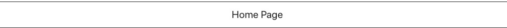

# HeadlineSimple

Displays a text as headline

<br>



<br>

Can receive information via :
- Parent component
- Slice Function

<br>

Array structure which needs to be inserted

````
let exampleData = [
    {
        "type": "heading1",
        "text": "Home Page",
        "spans": []
    }
]
````