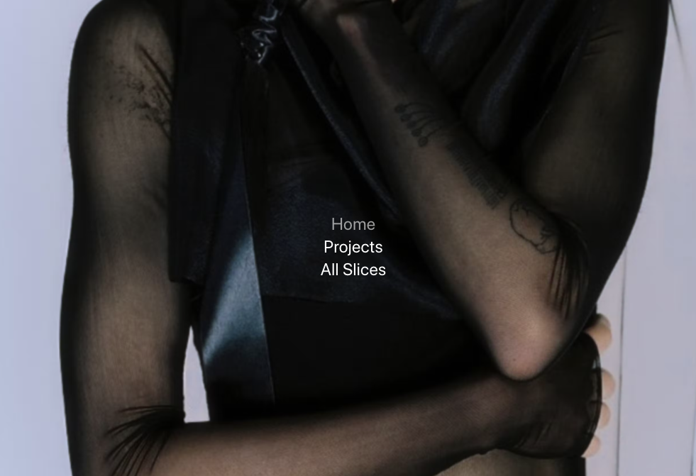

# NavigationFullBackground

Displays a navigation on top of a fullscreen image. By hovering other navigation items, the image in the background will change.

<br>



<br>

Can receive information via :
- Parent component
- Slice Function

<br>

Array structure which needs to be inserted

````
let exampleData = [
    {
    "primary": {
        "mobile_image": {
            "dimensions": {
                "width": 1920,
                "height": 2325
            },
            "alt": null,
            "copyright": null,
            "url": "https://images.prismic.io/mj-theme/b8824b07-2af0-4699-a5e8-1adcc57f1717_IMG100-web-1920x2325.jpg?auto=compress,format",
            "Big": {
                "dimensions": {
                    "width": 2500,
                    "height": 3027
                },
                "alt": null,
                "copyright": null,
                "url": "https://images.prismic.io/mj-theme/b8824b07-2af0-4699-a5e8-1adcc57f1717_IMG100-web-1920x2325.jpg?auto=compress,format&rect=0,0,1920,2325&w=2500&h=3027"
            },
            "Medium": {
                "dimensions": {
                    "width": 1500,
                    "height": 1816
                },
                "alt": null,
                "copyright": null,
                "url": "https://images.prismic.io/mj-theme/b8824b07-2af0-4699-a5e8-1adcc57f1717_IMG100-web-1920x2325.jpg?auto=compress,format&rect=0,0,1920,2324&w=1500&h=1816"
            },
            "Small": {
                "dimensions": {
                    "width": 750,
                    "height": 908
                },
                "alt": null,
                "copyright": null,
                "url": "https://images.prismic.io/mj-theme/b8824b07-2af0-4699-a5e8-1adcc57f1717_IMG100-web-1920x2325.jpg?auto=compress,format&rect=0,0,1920,2324&w=750&h=908"
            }
        }
    },
    "items": [
        {
            "image": {
                "dimensions": {
                    "width": 634,
                    "height": 793
                },
                "alt": null,
                "copyright": null,
                "url": "https://images.prismic.io/mj-theme/e913c998-2408-4a2a-811f-d543a8ec0e86_ILGIdeath2-crop.jpg?auto=compress,format",
                "Big": {
                    "dimensions": {
                        "width": 2500,
                        "height": 3127
                    },
                    "alt": null,
                    "copyright": null,
                    "url": "https://images.prismic.io/mj-theme/e913c998-2408-4a2a-811f-d543a8ec0e86_ILGIdeath2-crop.jpg?auto=compress,format&rect=0,0,634,793&w=2500&h=3127"
                },
                "Medium": {
                    "dimensions": {
                        "width": 1500,
                        "height": 1876
                    },
                    "alt": null,
                    "copyright": null,
                    "url": "https://images.prismic.io/mj-theme/e913c998-2408-4a2a-811f-d543a8ec0e86_ILGIdeath2-crop.jpg?auto=compress,format&rect=0,0,634,793&w=1500&h=1876"
                },
                "Small": {
                    "dimensions": {
                        "width": 750,
                        "height": 938
                    },
                    "alt": null,
                    "copyright": null,
                    "url": "https://images.prismic.io/mj-theme/e913c998-2408-4a2a-811f-d543a8ec0e86_ILGIdeath2-crop.jpg?auto=compress,format&rect=0,0,634,793&w=750&h=938"
                }
            },
            "name": [
                {
                    "type": "heading1",
                    "text": "Home",
                    "spans": []
                }
            ],
            "slug": [
                {
                    "type": "heading1",
                    "text": "",
                    "spans": []
                }
            ]
        },
        {
            "image": {
                "dimensions": {
                    "width": 1024,
                    "height": 1024
                },
                "alt": null,
                "copyright": null,
                "url": "https://images.prismic.io/mj-theme/8587e407-1e1f-4ad9-b920-e371d4f840cd_242690030_286989222937531_152258586832772908_n.jpg?auto=compress,format",
                "Big": {
                    "dimensions": {
                        "width": 2500,
                        "height": 2500
                    },
                    "alt": null,
                    "copyright": null,
                    "url": "https://images.prismic.io/mj-theme/8587e407-1e1f-4ad9-b920-e371d4f840cd_242690030_286989222937531_152258586832772908_n.jpg?auto=compress,format&rect=0,0,1024,1024&w=2500&h=2500"
                },
                "Medium": {
                    "dimensions": {
                        "width": 1500,
                        "height": 1500
                    },
                    "alt": null,
                    "copyright": null,
                    "url": "https://images.prismic.io/mj-theme/8587e407-1e1f-4ad9-b920-e371d4f840cd_242690030_286989222937531_152258586832772908_n.jpg?auto=compress,format&rect=0,0,1024,1024&w=1500&h=1500"
                },
                "Small": {
                    "dimensions": {
                        "width": 750,
                        "height": 750
                    },
                    "alt": null,
                    "copyright": null,
                    "url": "https://images.prismic.io/mj-theme/8587e407-1e1f-4ad9-b920-e371d4f840cd_242690030_286989222937531_152258586832772908_n.jpg?auto=compress,format&rect=0,0,1024,1024&w=750&h=750"
                }
            },
            "name": [
                {
                    "type": "heading1",
                    "text": "Projects",
                    "spans": []
                }
            ],
            "slug": [
                {
                    "type": "heading1",
                    "text": "projects",
                    "spans": []
                }
            ]
        },
        {
            "image": {
                "dimensions": {
                    "width": 720,
                    "height": 576
                },
                "alt": null,
                "copyright": null,
                "url": "https://images.prismic.io/mj-theme/d1e345e2-258b-4fa3-a54e-abe393636dde_TJ_15.jpg?auto=compress,format",
                "Big": {
                    "dimensions": {
                        "width": 2500,
                        "height": 2000
                    },
                    "alt": null,
                    "copyright": null,
                    "url": "https://images.prismic.io/mj-theme/d1e345e2-258b-4fa3-a54e-abe393636dde_TJ_15.jpg?auto=compress,format&rect=0,0,720,576&w=2500&h=2000"
                },
                "Medium": {
                    "dimensions": {
                        "width": 1500,
                        "height": 1200
                    },
                    "alt": null,
                    "copyright": null,
                    "url": "https://images.prismic.io/mj-theme/d1e345e2-258b-4fa3-a54e-abe393636dde_TJ_15.jpg?auto=compress,format&rect=0,0,720,576&w=1500&h=1200"
                },
                "Small": {
                    "dimensions": {
                        "width": 750,
                        "height": 600
                    },
                    "alt": null,
                    "copyright": null,
                    "url": "https://images.prismic.io/mj-theme/d1e345e2-258b-4fa3-a54e-abe393636dde_TJ_15.jpg?auto=compress,format&rect=0,0,720,576&w=750&h=600"
                }
            },
            "name": [
                {
                    "type": "heading1",
                    "text": "All Slices",
                    "spans": []
                }
            ],
            "slug": [
                {
                    "type": "heading1",
                    "text": "all-sclices",
                    "spans": []
                }
            ]
        }
    ],
    "slice_type": "navigation_fullpage_background",
    "slice_label": null
}
]
````