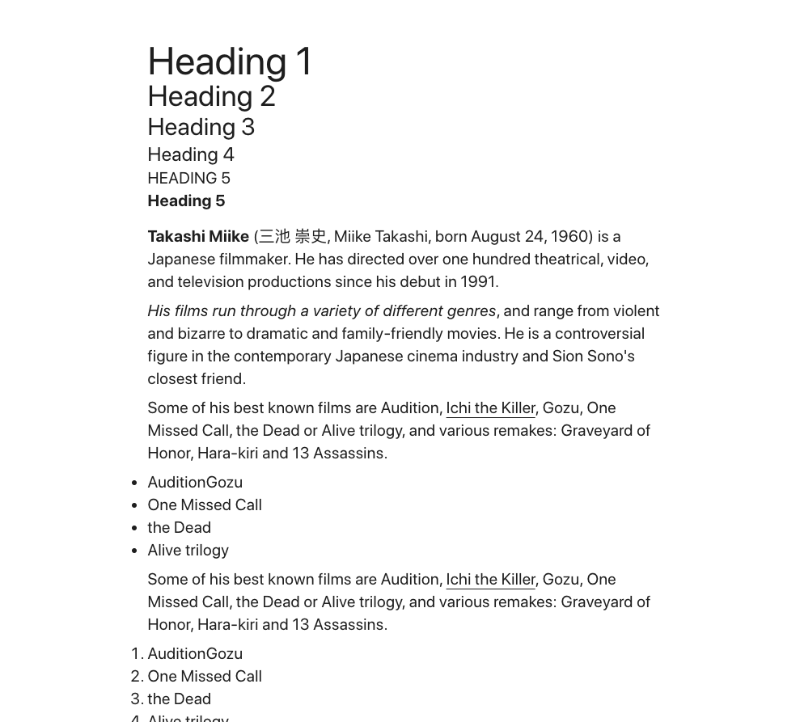

# ParagraphRichtextBig

Displays richtext from Prismic

<br>



<br>

Can receive information via :
- Parent component
- Slice Function

<br>

Array structure which needs to be inserted

````
let exampleData = [
    {
    "textalignment": "text-center",
    "long_text": [
        {
            "type": "paragraph",
            "text": "Threads explores the complex relationships formed between a photographer and their subject, presenting a range of intimate photographic exchanges amongst friends. Through this collaborative process, the series aims to tackle the politics of self-representation under post-colonial culture.",
            "spans": []
        }
    ]
}
]
````