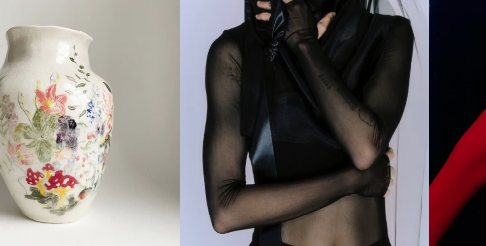

# SliderMouseMove

Displays a slider which lets you move the images horizontally by moving the mouse. On mobile you can swipe the images.

<br>



<br>

Can receive information via :
- Parent component
- Slice Function

<br>

Array structure which needs to be inserted

````
let exampleData = [
    {
        "image": {
            "dimensions": {
                "width": 1920,
                "height": 2792
            },
            "alt": null,
            "copyright": null,
            "url": "https://images.prismic.io/mj-theme/a35dd169-0a56-4925-97c5-92792eb92a8d_Michelle-and-Oscar-1920x2792.jpg?auto=compress,format",
            "Big": {
                "dimensions": {
                    "width": 2500,
                    "height": 3635
                },
                "alt": null,
                "copyright": null,
                "url": "https://images.prismic.io/mj-theme/a35dd169-0a56-4925-97c5-92792eb92a8d_Michelle-and-Oscar-1920x2792.jpg?auto=compress,format&rect=0,0,1920,2792&w=2500&h=3635"
            },
            "Medium": {
                "dimensions": {
                    "width": 1500,
                    "height": 2181
                },
                "alt": null,
                "copyright": null,
                "url": "https://images.prismic.io/mj-theme/a35dd169-0a56-4925-97c5-92792eb92a8d_Michelle-and-Oscar-1920x2792.jpg?auto=compress,format&rect=0,0,1920,2792&w=1500&h=2181"
            },
            "Small": {
                "dimensions": {
                    "width": 750,
                    "height": 1091
                },
                "alt": null,
                "copyright": null,
                "url": "https://images.prismic.io/mj-theme/a35dd169-0a56-4925-97c5-92792eb92a8d_Michelle-and-Oscar-1920x2792.jpg?auto=compress,format&rect=0,0,1919,2792&w=750&h=1091"
            }
        }
    },
    {
        "image": {
            "dimensions": {
                "width": 720,
                "height": 576
            },
            "alt": null,
            "copyright": null,
            "url": "https://images.prismic.io/mj-theme/d1e345e2-258b-4fa3-a54e-abe393636dde_TJ_15.jpg?auto=compress,format",
            "Big": {
                "dimensions": {
                    "width": 2500,
                    "height": 2000
                },
                "alt": null,
                "copyright": null,
                "url": "https://images.prismic.io/mj-theme/d1e345e2-258b-4fa3-a54e-abe393636dde_TJ_15.jpg?auto=compress,format&rect=0,0,720,576&w=2500&h=2000"
            },
            "Medium": {
                "dimensions": {
                    "width": 1500,
                    "height": 1200
                },
                "alt": null,
                "copyright": null,
                "url": "https://images.prismic.io/mj-theme/d1e345e2-258b-4fa3-a54e-abe393636dde_TJ_15.jpg?auto=compress,format&rect=0,0,720,576&w=1500&h=1200"
            },
            "Small": {
                "dimensions": {
                    "width": 750,
                    "height": 600
                },
                "alt": null,
                "copyright": null,
                "url": "https://images.prismic.io/mj-theme/d1e345e2-258b-4fa3-a54e-abe393636dde_TJ_15.jpg?auto=compress,format&rect=0,0,720,576&w=750&h=600"
            }
        }
    },
    {
        "image": {
            "dimensions": {
                "width": 1024,
                "height": 1024
            },
            "alt": null,
            "copyright": null,
            "url": "https://images.prismic.io/mj-theme/8587e407-1e1f-4ad9-b920-e371d4f840cd_242690030_286989222937531_152258586832772908_n.jpg?auto=compress,format",
            "Big": {
                "dimensions": {
                    "width": 2500,
                    "height": 2500
                },
                "alt": null,
                "copyright": null,
                "url": "https://images.prismic.io/mj-theme/8587e407-1e1f-4ad9-b920-e371d4f840cd_242690030_286989222937531_152258586832772908_n.jpg?auto=compress,format&rect=0,0,1024,1024&w=2500&h=2500"
            },
            "Medium": {
                "dimensions": {
                    "width": 1500,
                    "height": 1500
                },
                "alt": null,
                "copyright": null,
                "url": "https://images.prismic.io/mj-theme/8587e407-1e1f-4ad9-b920-e371d4f840cd_242690030_286989222937531_152258586832772908_n.jpg?auto=compress,format&rect=0,0,1024,1024&w=1500&h=1500"
            },
            "Small": {
                "dimensions": {
                    "width": 750,
                    "height": 750
                },
                "alt": null,
                "copyright": null,
                "url": "https://images.prismic.io/mj-theme/8587e407-1e1f-4ad9-b920-e371d4f840cd_242690030_286989222937531_152258586832772908_n.jpg?auto=compress,format&rect=0,0,1024,1024&w=750&h=750"
            }
        }
    },
    {
        "image": {
            "dimensions": {
                "width": 634,
                "height": 793
            },
            "alt": null,
            "copyright": null,
            "url": "https://images.prismic.io/mj-theme/e913c998-2408-4a2a-811f-d543a8ec0e86_ILGIdeath2-crop.jpg?auto=compress,format",
            "Big": {
                "dimensions": {
                    "width": 2500,
                    "height": 3127
                },
                "alt": null,
                "copyright": null,
                "url": "https://images.prismic.io/mj-theme/e913c998-2408-4a2a-811f-d543a8ec0e86_ILGIdeath2-crop.jpg?auto=compress,format&rect=0,0,634,793&w=2500&h=3127"
            },
            "Medium": {
                "dimensions": {
                    "width": 1500,
                    "height": 1876
                },
                "alt": null,
                "copyright": null,
                "url": "https://images.prismic.io/mj-theme/e913c998-2408-4a2a-811f-d543a8ec0e86_ILGIdeath2-crop.jpg?auto=compress,format&rect=0,0,634,793&w=1500&h=1876"
            },
            "Small": {
                "dimensions": {
                    "width": 750,
                    "height": 938
                },
                "alt": null,
                "copyright": null,
                "url": "https://images.prismic.io/mj-theme/e913c998-2408-4a2a-811f-d543a8ec0e86_ILGIdeath2-crop.jpg?auto=compress,format&rect=0,0,634,793&w=750&h=938"
            }
        }
    },
    {
        "image": {
            "dimensions": {
                "width": 1920,
                "height": 2325
            },
            "alt": null,
            "copyright": null,
            "url": "https://images.prismic.io/mj-theme/b8824b07-2af0-4699-a5e8-1adcc57f1717_IMG100-web-1920x2325.jpg?auto=compress,format",
            "Big": {
                "dimensions": {
                    "width": 2500,
                    "height": 3027
                },
                "alt": null,
                "copyright": null,
                "url": "https://images.prismic.io/mj-theme/b8824b07-2af0-4699-a5e8-1adcc57f1717_IMG100-web-1920x2325.jpg?auto=compress,format&rect=0,0,1920,2325&w=2500&h=3027"
            },
            "Medium": {
                "dimensions": {
                    "width": 1500,
                    "height": 1816
                },
                "alt": null,
                "copyright": null,
                "url": "https://images.prismic.io/mj-theme/b8824b07-2af0-4699-a5e8-1adcc57f1717_IMG100-web-1920x2325.jpg?auto=compress,format&rect=0,0,1920,2324&w=1500&h=1816"
            },
            "Small": {
                "dimensions": {
                    "width": 750,
                    "height": 908
                },
                "alt": null,
                "copyright": null,
                "url": "https://images.prismic.io/mj-theme/b8824b07-2af0-4699-a5e8-1adcc57f1717_IMG100-web-1920x2325.jpg?auto=compress,format&rect=0,0,1920,2324&w=750&h=908"
            }
        }
    },
    {
        "image": {
            "dimensions": {
                "width": 2000,
                "height": 2000
            },
            "alt": null,
            "copyright": null,
            "url": "https://images.prismic.io/mj-theme/7369dce5-6c4f-453d-89eb-2d65105b5e42_ALBUMCOVERART.jpg?auto=compress,format",
            "Big": {
                "dimensions": {
                    "width": 2500,
                    "height": 2500
                },
                "alt": null,
                "copyright": null,
                "url": "https://images.prismic.io/mj-theme/7369dce5-6c4f-453d-89eb-2d65105b5e42_ALBUMCOVERART.jpg?auto=compress,format&rect=0,0,2000,2000&w=2500&h=2500"
            },
            "Medium": {
                "dimensions": {
                    "width": 1500,
                    "height": 1500
                },
                "alt": null,
                "copyright": null,
                "url": "https://images.prismic.io/mj-theme/7369dce5-6c4f-453d-89eb-2d65105b5e42_ALBUMCOVERART.jpg?auto=compress,format&rect=0,0,2000,2000&w=1500&h=1500"
            },
            "Small": {
                "dimensions": {
                    "width": 750,
                    "height": 750
                },
                "alt": null,
                "copyright": null,
                "url": "https://images.prismic.io/mj-theme/7369dce5-6c4f-453d-89eb-2d65105b5e42_ALBUMCOVERART.jpg?auto=compress,format&rect=0,0,2000,2000&w=750&h=750"
            }
        }
    }
]
````