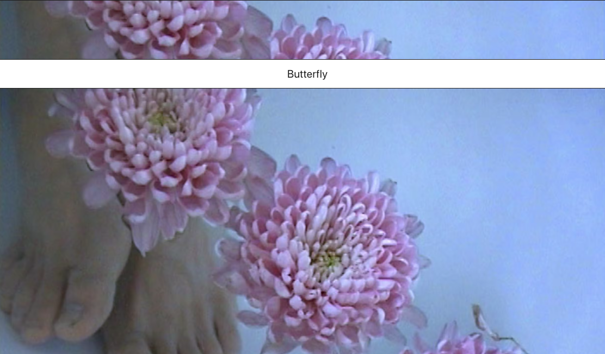

# LayoutCover

Module that adds a fullscreen cover region to the page. On click it will slide up and reveal the content below.

<br>

Good for project pages on portfolios

<br>



<br>

Can receive information via :
- Parent component

<br>

Array structure which needs to be inserted

````
let exampleData = [
    {
        "dimensions": {
            "width": 720,
            "height": 576
        },
        "alt": null,
        "copyright": null,
        "url": "https://images.prismic.io/mj-theme/d1e345e2-258b-4fa3-a54e-abe393636dde_TJ_15.jpg?auto=compress,format",
        "Big": {
            "dimensions": {
                "width": 2500,
                "height": 2000
            },
            "alt": null,
            "copyright": null,
            "url": "https://images.prismic.io/mj-theme/d1e345e2-258b-4fa3-a54e-abe393636dde_TJ_15.jpg?auto=compress,format&rect=0,0,720,576&w=2500&h=2000"
        },
        "Medium": {
            "dimensions": {
                "width": 1500,
                "height": 1200
            },
            "alt": null,
            "copyright": null,
            "url": "https://images.prismic.io/mj-theme/d1e345e2-258b-4fa3-a54e-abe393636dde_TJ_15.jpg?auto=compress,format&rect=0,0,720,576&w=1500&h=1200"
        },
        "Small": {
            "dimensions": {
                "width": 750,
                "height": 600
            },
            "alt": null,
            "copyright": null,
            "url": "https://images.prismic.io/mj-theme/d1e345e2-258b-4fa3-a54e-abe393636dde_TJ_15.jpg?auto=compress,format&rect=0,0,720,576&w=750&h=600"
        }
    }
]
````