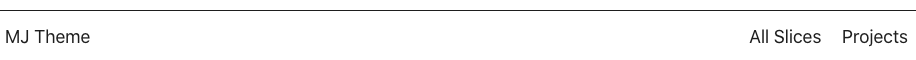

# FooterSimple

Footerbar which displays the title and the footer navigation

<br>



<br>

Can receive information via :
- Parent component

<br>

Array structure which needs to be inserted

````
let exampleData = [
    {
        "title": [
            {
                "type": "heading1",
                "text": "All Slices",
                "spans": []
            }
        ],
        "uid1": [
            {
                "type": "heading1",
                "text": "all-slices",
                "spans": []
            }
        ],
        "target": false
    },
    {
        "title": [
            {
                "type": "heading1",
                "text": "Projects",
                "spans": []
            }
        ],
        "uid1": [
            {
                "type": "heading1",
                "text": "projects",
                "spans": []
            }
        ],
        "target": true
    }
]

let exampleData = [
    {
        "type": "heading1",
        "text": "MJ Theme",
        "spans": []
    }
]
````